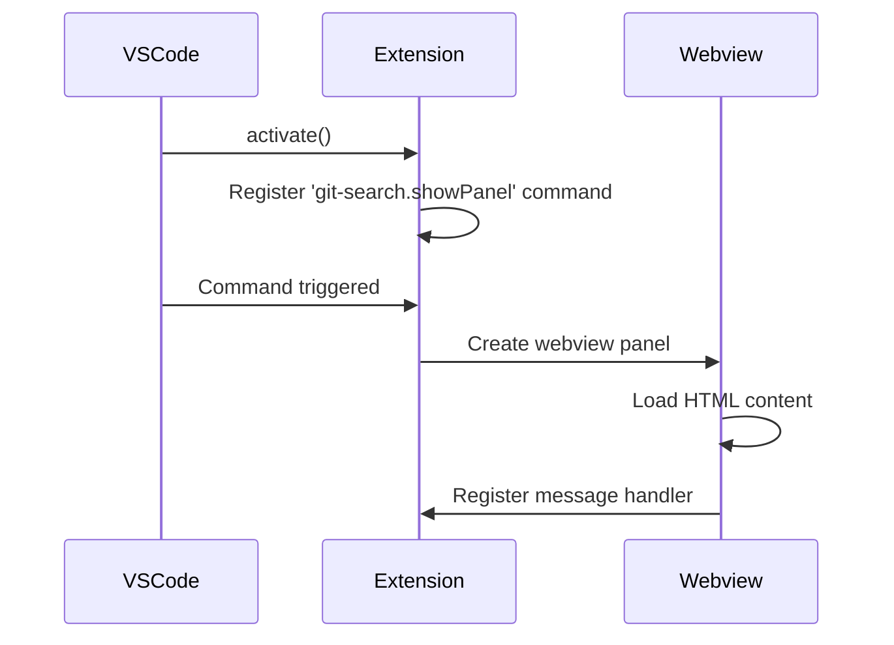
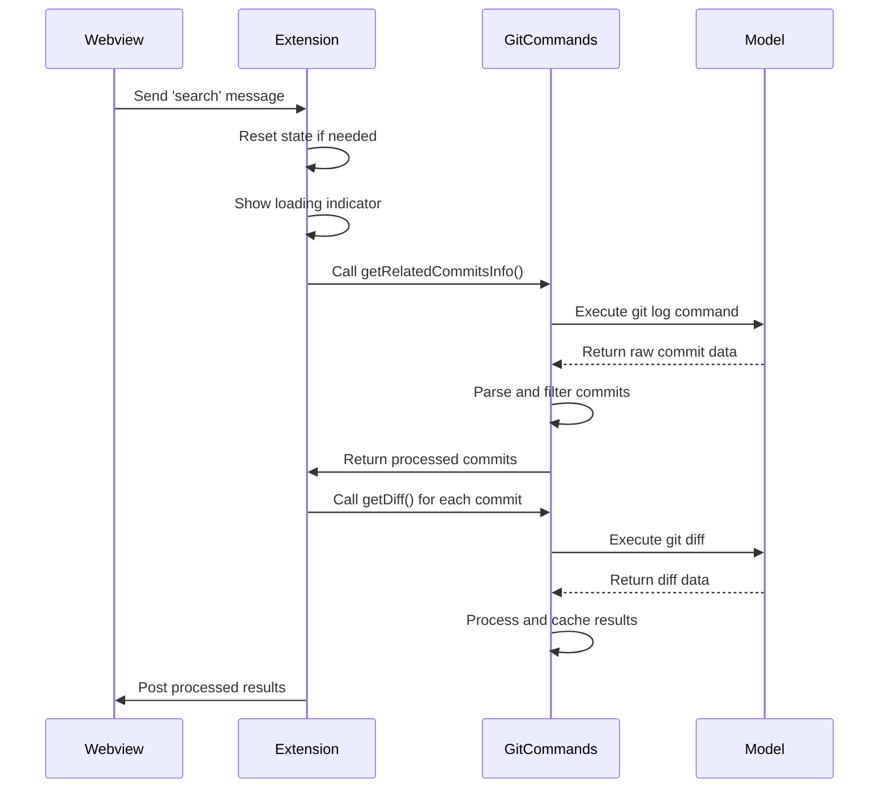
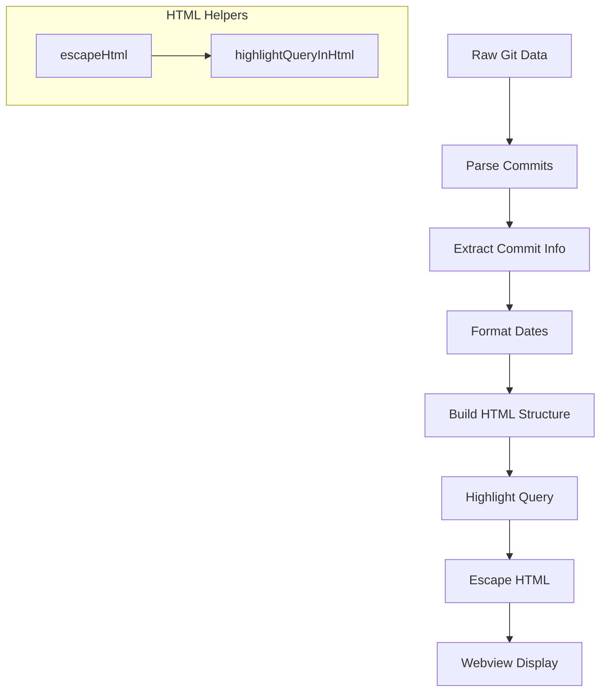
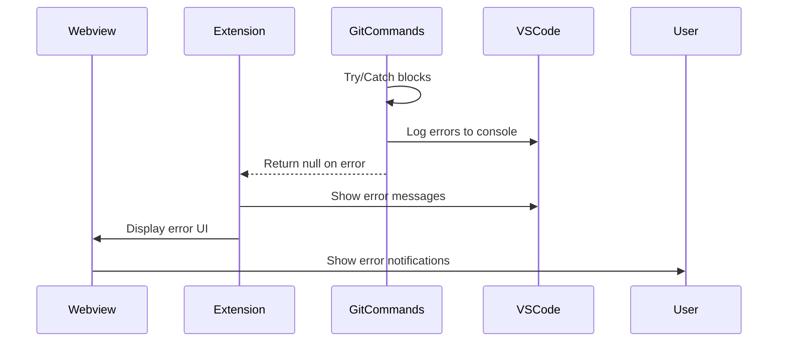

# Workflow Documentation

## 1. Extension Activation

**Activation Sequence:**

1. Extension initializes via `activate()` function
2. Registers command "git-search.showPanel" with VS Code
3. When command is triggered:
   - Creates webview panel with HTML content
   - Sets up message handler for webview communication
4. Exports key functions for external access

## 2. Git Search Command

**Execution Flow:**

1. Webview sends search command with query
2. Extension resets state and shows loading UI
3. GitCommands executes git log with search pattern
4. Raw commit data is parsed and filtered
5. Parallel diff requests are made for each commit
6. Results are processed, cached, and sent back to webview

## 3. Results Rendering

**UI Update Sequence:**

1. Raw git data is transformed into structured objects
2. Commit metadata is formatted (dates, authors)
3. HTML structure is built with:
   - Commit headers
   - File details
   - Diff displays
4. Query highlighting applied using regex
5. HTML escaping prevents XSS vulnerabilities
6. Final content sent to webview for display

## 4. Error Handling

**Error Propagation Workflow:**

1. Git commands use try/catch for error capture
2. Errors are logged to VS Code's output channel
3. Null values propagate through the pipeline
4. Extension displays error UI in webview
5. Critical errors show VS Code error notifications
6. Webview displays user-friendly error messages

## Areas to Improve

### State Handling Simplification

Current state management could be simplified using signals-based architecture. Potential improvements:

- Replace manual state updates with reactive signals
- Centralize state management using a library like Preact Signals
- Reduce callback nesting through signal subscriptions
