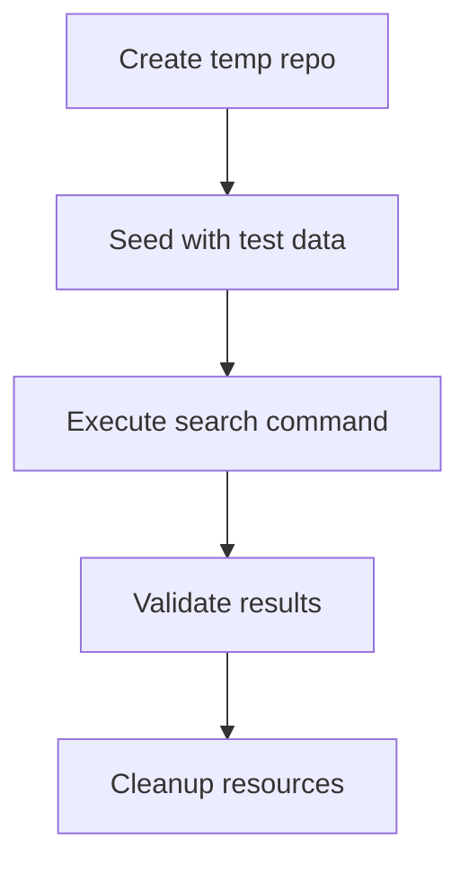

# Testing Strategy for VS Code Extension User Flows

## 1. Approach Evaluation

| Approach                | Pros                                | Cons                          |
| ----------------------- | ----------------------------------- | ----------------------------- |
| **Real Git Repo**       | - End-to-end validation             | - Slower execution            |
| in `/tmp` (proposed)    | - Tests actual Git behavior         | - Requires cleanup            |
|                         |                                     | - Potential flakiness         |
| **Mocked Git Commands** | - Fast execution                    | - May miss real-world issues  |
| (current)               | - Deterministic results             |                               |
| **Hybrid Approach**     | - Best of both worlds               | - More complex implementation |
|                         | - Real repos for critical workflows |                               |

## 2. Recommended Strategy

### Integration Tests with Real Repositories

- **Scope**:

  - Search initialization
  - Result retrieval
  - History navigation

- **Directory Structure**: `/tmp/git-search-tests-<timestamp>`

- **Test Lifecycle**:



## 3. Implementation Outline

- **Test File**: `test/suite/integration.test.js`
- **Key Dependencies**:

  - `fs-extra` (for file operations)
  - `simple-git` (for Git repository management)

- **Sample Test Case**:

```javascript
describe("Integration: Git Search", () => {
  it("should find commits in real repository", async () => {
    // Setup temp repo
    // Add test files and commits
    // Execute search
    // Assert results
  });
});
```
