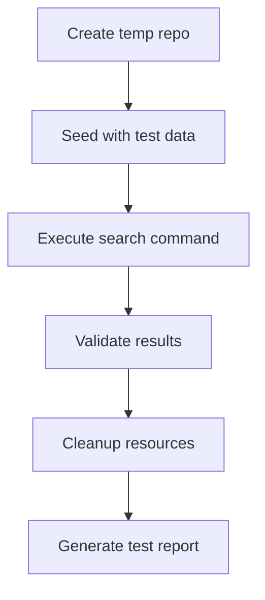
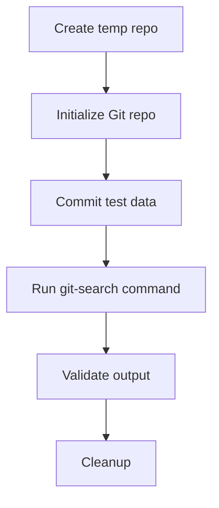

# Git Search Extension Testing PRD

## 1. Approach Evaluation

### Git Operations Comparison

| Approach                | Pros                                | Cons                          |
| ----------------------- | ----------------------------------- | ----------------------------- |
| **Real Git Repo**       | - End-to-end validation             | - Slower execution            |
| in `/tmp`               | - Tests actual Git behavior         | - Requires cleanup            |
|                         |                                     | - Potential flakiness         |
| **Mocked Git Commands** | - Fast execution                    | - May miss real-world issues  |
|                         | - Deterministic results             |                               |
| **Hybrid Approach**     | - Best of both worlds               | - More complex implementation |
|                         | - Real repos for critical workflows |                               |

**Justification**: The hybrid approach balances thoroughness and efficiency by:

- Using real Git operations for core user flows (search, history)
- Mocking peripheral Git interactions
- Isolating test-specific Git operations

## 2. Scope Definition

### Test Scenarios

- Search initialization with various patterns
- Result retrieval across commit history
- History navigation (forward/backward)
- Edge case handling (empty repos, invalid patterns)
- Performance under large repo conditions

### Functionality Coverage

- Git command execution pipeline
- Result parsing and display
- Error handling and user feedback
- History state management

### Acceptance Criteria

- 100% passing tests for critical workflows
- 90%+ coverage for secondary features
- Execution time under 5 minutes
- No flaky tests (retries < 3)

## 3. Environment Setup

### Temp Directory Structure

```
/tmp/git-search-tests-<timestamp>/
├── test-repos/
│   ├── basic/
│   └── edge-cases/
├── fixtures/
│   ├── large-files/
│   └── history-tests/
└── logs/
```

### Required Tools

- Mocha (test framework)
- Chai (assertion library)
- Sinon (test spies)
- tmp-promise (temp directory management)

### Setup Commands

```bash
npm install --save-dev mocha chai sinon tmp-promise
mkdir -p test/fixtures/{large-files,history-tests}
```

## 4. Test Lifecycle



### Phase Descriptions

1. **Repo Creation**: Use tmp-promise to create isolated test environments
2. **Data Seeding**: Populate with test commits and file structures
3. **Command Execution**: Run actual Git search operations
4. **Result Validation**: Use Chai assertions for strict validation
5. **Cleanup**: Ensure resource release even on test failure

## 5. Implementation Details

### Real Git Repo Testing Implementation

#### Repository Creation

- Use `tmp-promise` to create isolated temporary repos
- Initialize with `git init` and configure user/email
- Create test commits with known content patterns

#### Test Execution Flow



#### Code Structure

```
test/
├── suite/
│   └── real-git.test.js      # Core Git integration tests
├── fixtures/
│   └── repo-templates/       # Predefined repo structures
│       └── basic-commit.js
└── utils/
    └── git-repo.js           # Git operations helper
```

### Core Test Patterns for Real Git Testing

- **Git Lifecycle Hooks**: Before/After hooks for repo initialization/cleanup
- **Parameterized Git Tests**: Test various Git operations (commit, branch, merge)
- **Timeout Handling**: 5s max for repo operations, 10s for large repos
- **Git State Verification**: Check commit hashes, branch pointers, and reflogs
- **Error Scenario Testing**: Simulate Git errors (detached HEAD, merge conflicts)

**Test Implementation Status**:

- ✅ `real-git.test.js` implemented with:
  - Basic file matching
  - Multi-commit history
  - Empty repo handling
- ⏳ Pending:
  - Large file performance tests
  - Concurrent execution tests
  - Branch/merge scenario tests

### Assertion Methods

- `expect(result).to.have.property('matches')`
- `expect(output).to.match(/expected-pattern/)`
- `expect(error).to.be.null`
- `expect(performance).to.be.below(threshold)`

## 6. Risk Analysis

### Edge Cases

- Empty repository handling
- Invalid Git operations
- Large file processing
- Concurrent test execution

### Mitigation Strategies

- Pre-test repo validation
- Cleanup hooks in finally blocks
- Resource timeouts (5s per operation)
- Isolated temp directories per test

### Git-Specific Flakiness Mitigation

- **Repo Cleanup**: Force remove temp dirs with `rm -rf` on failure
- **Git Process Kill**: Terminate hanging Git processes after 10s
- **Retry Strategy**:
  - 3 retries for network-related failures
  - 2 retries for repo corruption errors
- **Resource Monitoring**:
  - Max Git processes: 5 concurrent
  - Disk space check: 2GB free required

**Test Execution**:

```bash
# Run real Git tests
npx mocha test/suite/real-git.test.js
```
