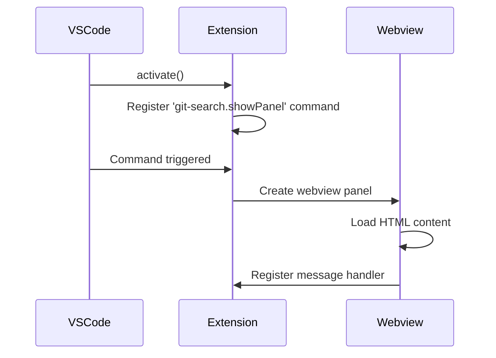
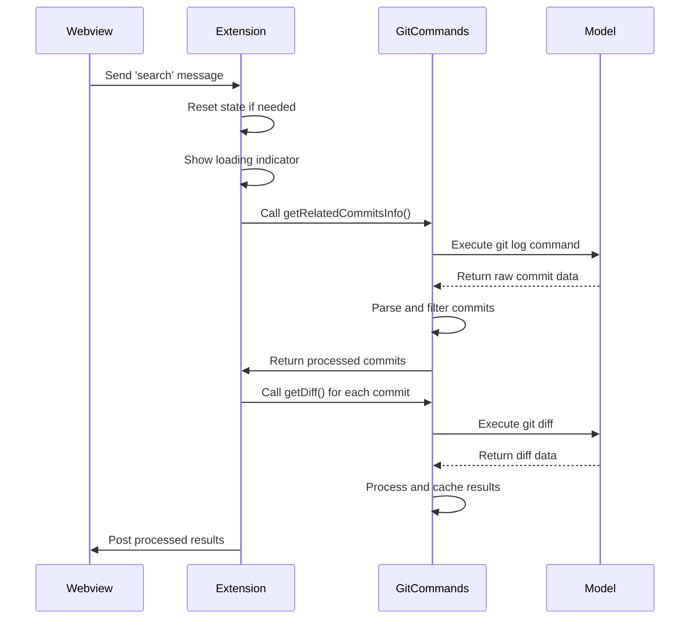
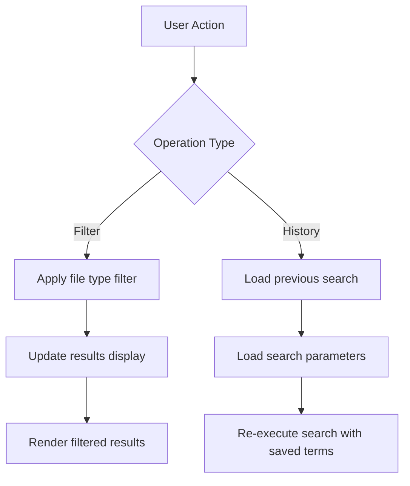

# User Flows

## 1. Search Initialization

1. User invokes "Git Search" from command palette
2. Webview panel opens with search input

## 2. Query Execution

1. User enters search terms
2. Results display in virtualized list
3. Clicking result opens file at line

## 3. Advanced Operations

1. Filtering by file type
2. Search history navigation

